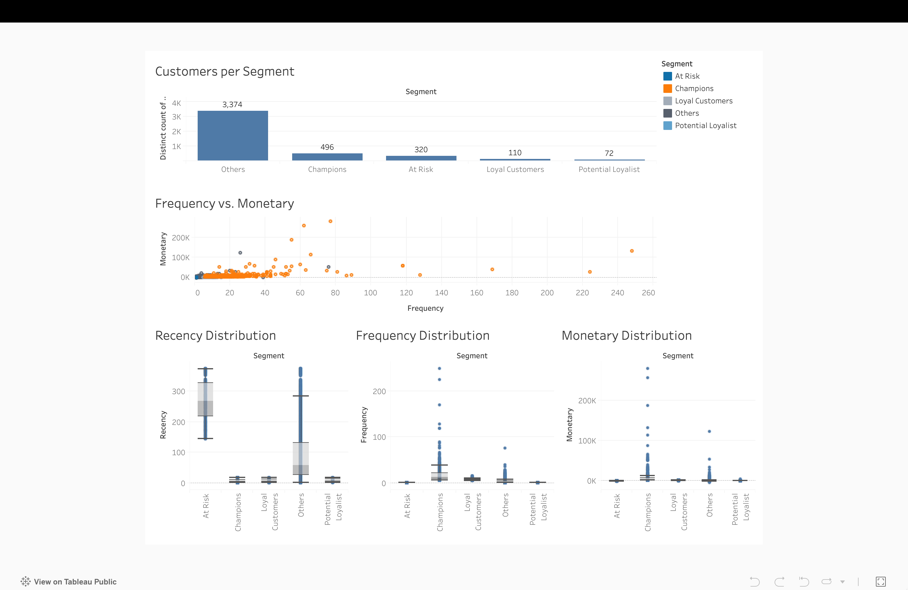

# Customer Segmentation Dashboard

## Project Overview

A data analysis portfolio project to segment e-commerce customers using RFM analysis and visualize insights.

## Folder Structure

- `notebooks/` — Jupyter notebooks for each project phase
- `data/` — Raw and processed data files (e.g., CSVs)
- `ecommerce_data.db` — SQLite database for all data processing

## Phases

### Phase 1: Data Collection and Preparation
- **Notebook:** `notebooks/phase_1_data_collection.ipynb`
- **Goal:** Import e-commerce data into SQLite and explore its structure.
- **Output:** `data.csv` in `data/`, `transactions` table in SQLite.

### Phase 2: Data Cleaning and Preprocessing
- **Notebook:** `notebooks/phase_2_data_cleaning.ipynb`
- **Goal:** Remove duplicates, handle missing values, convert dates, and calculate total spend.
- **Output:** `transactions_clean` table in SQLite, `transactions_clean.csv` in `data/`.

### Phase 3: Calculating RFM Scores
- **Notebook:** `notebooks/phase_3_rfm_analysis.ipynb`
- **Goal:** Compute Recency, Frequency, and Monetary metrics for each customer.
- **Output:** `rfm` table in SQLite, `rfm.csv` in `data/`.

### Phase 4: Segmenting Customers
- **Notebook:** `notebooks/phase_4_segmentation.ipynb`
- **Goal:** Assign RFM-based scores and customer segments, validate segment distribution.
- **Output:** `rfm_segmented` table in SQLite, `rfm_segmented.csv` in `data/`.

### Phase 5: Data Visualization with Tableau
- **Tableau Public Link:** [https://public.tableau.com/views/CustomerSegmentationDashboard](https://public.tableau.com/views/CustomerSegmentationDashboard_17488261585640/CustomerSegmentationDashboard?:language=en-US&:sid=&:redirect=auth&:display_count=n&:origin=viz_share_link)

## Analysis Report

### Executive Summary
This report analyzes the customer segmentation dashboard, which provides insights into customer distribution, purchasing behavior, and value across five segments: Others, Champions, At Risk, Loyal Customers, and Potential Loyalist. The data highlights significant variations in customer count, frequency, recency, and monetary contributions, offering actionable insights for targeted marketing and retention strategies. The analysis of RFM distributions reveals distinct customer behaviors, with Champions as highly valuable, recent, and frequent buyers, while At Risk and Others are largely inactive with high recency. Loyal Customers and Potential Loyalists offer growth opportunities, and outliers in Frequency and Monetary distributions for Champions and Others indicate a small group driving most activity and revenue.

### Key Findings
#### Customer Distribution (Customers per Segment)
The "Others" segment dominates with 3,374 customers (approximately 75% of the total), indicating a large, potentially untapped or inactive group.  
"Champions" (496 customers) and "At Risk" (320 customers) follow, with "Loyal Customers" (110) and "Potential Loyalist" (72) representing smaller but critical segments.  
Focus should be on converting "Others" into active segments and retaining "Champions" while addressing "At Risk" customers.

#### Frequency vs. Monetary Analysis
A scatter plot reveals "Champions" exhibit the highest frequency (up to 260 transactions) and monetary value (up to 250K), making them the most valuable segment.  
"Others" show moderate frequency but low monetary value, suggesting infrequent high-value purchases or inconsistent engagement.  
"At Risk" customers have declining frequency, indicating a need for re-engagement campaigns.  
"Loyal Customers" and "Potential Loyalist" show lower frequency and monetary contributions, requiring nurturing to increase value.

#### Recency Distribution Analysis
- **At Risk** and **Others** segments show the highest recency values, with medians well above 100 and a wide distribution. This signifies that a majority of these customers have not made a purchase in a long time and are likely inactive or lapsed.
- **Champions**, **Loyal Customers**, and **Potential Loyalists** exhibit low recency medians, all close to zero. This is a positive indicator, showing these segments consist of recent purchasers. The tight interquartile range (IQR) for these groups suggests consistent recent interaction.
- **Insight**: The most significant challenge is the large group of inactive customers in the `At Risk` and `Others` segments. Immediate action is required to re-engage them before they are lost permanently.

#### Frequency Distribution Analysis
- Most segments have a low median frequency, with boxplots compressed near the bottom of the scale. This suggests that the typical customer across all segments does not purchase very often.
- The key differentiators are the **outliers**. The **Champions** segment, and to a lesser extent the `Others` and `Loyal Customers` segments, have significant outliers with very high purchase frequencies. These outliers represent the most active and engaged customers.
- The **At Risk** and **Potential Loyalist** segments show minimal frequency, which is expected given their definitions.
- **Insight**: Business strategy should not treat all customers within a segment equally. The high-frequency outliers, especially among `Champions`, are critical assets. The `Others` segment contains high-frequency outliers who are not recent buyers, representing a unique win-back opportunity.

#### Monetary Distribution Analysis
- Similar to frequency, the monetary distribution is heavily skewed. The boxplots for all segments are low, indicating that the majority of purchases are of low monetary value.
- High-value transactions are driven by **outliers**. The **Champions** segment clearly has the highest-value outliers, reaching up to $279K, confirming their status as top spenders.
- The **Others** segment also contains some high-spending outliers, which is notable given their high recency. These are likely customers who made large purchases in the past but have since become inactive.
- **Insight**: Revenue is highly concentrated among a small number of high-spending customers. Identifying and understanding the behavior of these monetary outliers within the `Champions` and `Others` segments is crucial for driving revenue growth.

### Recommendations
- **Nurture Champions**: These are your best customers.
  - **Action**: Implement a loyalty program with exclusive rewards, early access to products, and personalized communication. Acknowledge their value to foster continued engagement. Do not risk losing them with generic marketing.
- **Upsell Loyal Customers**: This group is active and recent but has lower frequency and spending than Champions.
  - **Action**: Target them with upselling and cross-selling campaigns. Introduce them to higher-value products or encourage bundle purchases to increase their monetary value and frequency.
- **Engage Potential Loyalists**: These are recent customers with growth potential.
  - **Action**: Cultivate their loyalty with targeted follow-up campaigns and incentives for a second or third purchase. The goal is to increase their frequency and move them into the `Loyal Customers` or `Champions` segment.
- **Reactivate "At Risk" Customers**: This group has high recency and requires immediate attention. Confirmed by [t-test](https://github.com/bitsbard/customer-retention-t-test).
  - **Action**: Launch aggressive "win-back" campaigns. Offer significant, personalized discounts or promotions based on their past purchase history to incentivize a new purchase.
- **Segment and Investigate "Others"**: This is a mixed-signal group.
  - **Action**: Further segment this group. The majority are likely lost causes with high recency and low F/M values; consider excluding them from active marketing to reduce costs. However, the high-value F/M outliers within this segment are a top priority. Target them with specialized, high-touch re-engagement campaigns to understand why they stopped purchasing and win them back.
